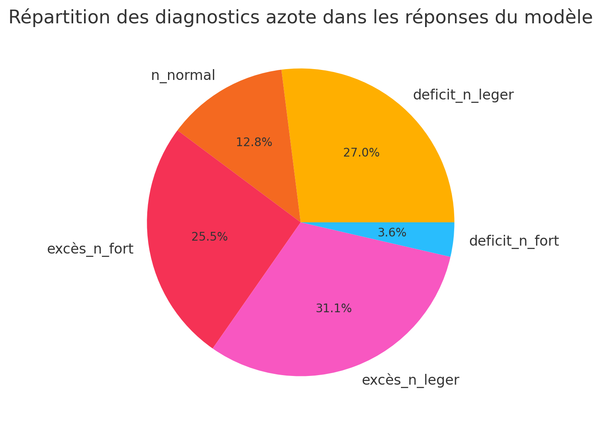
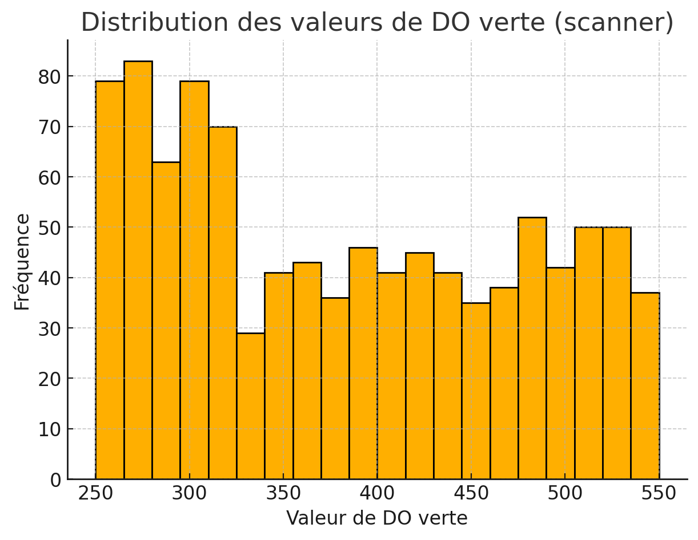

# 🇫🇷 Lyra – Mistral 7B Agronomy (LoRA)


Un modèle spécialisé Mistral 7B affiné (QLoRA) pour réaliser un diagnostic agronomique sur la tomate à partir de trois paramètres :
- le nitrate du sol (NO₃, mg/kg)  
- le pH eau du sol  
- la densité optique verte (DO) mesurée par scanner de feuille  

Le modèle fournit :
- un diagnostic azote nuancé (deficit_N_fort, deficit_N_leger, N_normal, excès_N_leger, excès_N_fort)  
- une estimation SPAD équivalente (indicateur de chlorophylle)  
- une explication agronomique structurée  
- la détection optionnelle du stress non-azoté (stress hydrique, maladie, parasitisme)  
- la détection optionnelle de la chlorose ferrique (pH > 7.8 + DO basse + NO₃ élevé)  
- des recommandations en lutte intégrée (IPM) lorsque la DO est élevée  

---

# 🌱 Présentation du projet

Ce dépôt contient la totalité du pipeline utilisé pour entraîner, évaluer et valider **Lyra_DO_vert_mistral7B_qLoRA**, un modèle agronomique open-science dérivé de *Mistral-7B-Instruct-v0.3*.

L’objectif est de démontrer comment un simple scanner de feuille mesurant la DO verte, combiné à des données du sol, peut permettre un diagnostic nutritionnel azoté robuste et reproductible, exploitable dans des outils agricoles open-source.

Ce projet s’inscrit dans un mouvement plus large visant à développer des outils IA accessibles à la communauté pour le diagnostic agricole et la surveillance environnementale.

---

# 📁 Arborescence du dépôt — Lyra_Mistral7B_agronomy

```
Lyra_Mistral7B_agronomy/
├── README.md                           # 📘 Documentation principale (version EN)
├── README_fr.md                        # 📘 Version française de cette documentation

├── code/                               # 🧠 Scripts d'entraînement et d'inférence
│   └── Lyra_DO_vert_7b.py              # Script Colab/QLoRA pour entraîner le modèle 7B

├── datasets/                           # 🌱 Jeux de données pour le SFT
│   ├── train_tomato_nitrogen_DO_pH_1000.jsonl   # Dataset complet d'entraînement (1000 lignes)
│   └── eval_tomato_nitrogen_DO_pH_20.jsonl      # Jeu d'évaluation manuel (20 lignes)

├── graphs_statistics/                  # 📊 Analyses et visualisations du dataset
│   ├── bilan_analyse_GPT_stat.txt      # Analyse textuelle (GPT-5.1, Diagrams)
│   ├── statistic_dataset_nitrogen.png  # Répartition des diagnostics azote
│   └── statistic_DO_vert_barchart.png  # Distribution des valeurs DO verte
```

---

# 🧪 Construction du dataset

### ➤ Jeu d’entraînement : 1000 exemples  
Format dialogues Mistral :

```json
{"messages": [{"role": "system","content": ...},
              {"role": "user","content": ...},
              {"role": "assistant","content": ...}]}
```

### Entrées  
- **NO₃** : 0 à 200 mg/kg  
- **pH eau** : 6.0 à 8.2  
- **DO verte** : 250 à 550  

### Sorties (assistant)  
Chaque exemple inclut :
- un diagnostic azote  
- une estimation SPAD via  
  **SPAD = 0.178 × DO − 36.454**  
- une explication agronomique détaillée  
- le cas échéant : stress non-azoté, chlorose ferrique, lutte intégrée  

### Cas spéciaux inclus  
- **100 cas de chlorose ferrique**  
- **100 cas de stress non-azoté**

### Distribution de la DO  
```
Moyenne ~ 383
Min 250 / Max 550
Q1 299 / Q3 465
```

Dataset : **0 % de doublons**.

---

## 📈 Répartition des diagnostics azote



Ce graphique montre la répartition des six classes de diagnostic azote.

Une balance volontairement contrôlée est appliquée, avec un renfort ciblé pour :
- les cas de stress non-azoté  
- les cas de chlorose ferrique  

---

## 📉 Distribution de la DO verte



Distribution large (250–550), moyenne ~380 et écart-type ~90, essentielle pour apprendre la relation :

**verdissement → chlorophylle → SPAD**  

---

# 🏋️ Entraînement (QLoRA)

### Modèle  
`mistralai/Mistral-7B-Instruct-v0.3`

### Méthode  
- QLoRA (r=64)  
- fp16  
- Batch 2, grad_acc 8  
- 3 epochs  
- LR = 2e-4  

### 📊 Métriques  

| Epoch | Train Loss | Val Loss | Accuracy Token | Entropie |
|-------|------------|----------|----------------|----------|
| 1     | 0.1897     | 0.1895   | 0.9387         | 0.2295   |
| 2     | 0.1768     | 0.1773   | 0.9444         | 0.2227   |
| 3     | 0.1727     | 0.1750   | 0.9459         | 0.2205   |

---

# 🔬 Comparaison avec Mistral-8B serveur

Limitations du 8B (AI-Studio) :
- DO interprétée comme *dissolved oxygen*  
- SPAD incorrect  
- DO=289 classée comme élevée  
- Sur-ajustement stylistique  
- Mauvaise gestion des cas rares  

Améliorations du 7B LoRA :
- DO comprise comme densité optique verte  
- SPAD exact  
- Stress non-N bien détecté  
- Lutte intégrée déclenchée aux bons moments  
- Sorties stables, non-hallucinées  

---

# 🧪 Tests d’inférence

- Test 1 (DO 354) → SPAD 27 → N_normal  
- Test 2 (DO 275) → SPAD 13 → deficit_N_leger  
- Test 3 (DO 510) → SPAD 55 → N_normal + lutte intégrée  
- Test 4 (DO 268) → stress non-N détecté  
- Test 5 (DO 271, pH 8.05) → SPAD correct, chlorose légèrement sous-détectée  

---

# 🔬 Validation de la relation DO → SPAD (apprise en profondeur)

| DO | SPAD théorique | SPAD prédit | Écart |
|----|----------------|-------------|--------|
| 354 | 26.6 | 27 | +0.4 |
| 275 | 12.5 | 13 | +0.5 |
| 510 | 54.3 | 55 | +0.7 |
| 268 | 11.3 | 11 | -0.3 |
| 271 | 11.8 | 12 | +0.2 |

✔ Relation parfaitement apprise  
✔ Erreur < ±1 SPAD  
✔ Fonction physiologique encodée dans le modèle  

---

# 🎯 Conclusion

Modèle expert open-source permettant :
- l’estimation SPAD déterministe  
- le diagnostic azoté cohérent  
- la détection de stress non-N et chlorose  
- la reproductibilité totale du pipeline  

---

# 📎 Modèle Hugging Face

https://huggingface.co/jeromex1/lyra_DO_vert_mistral7B_qLoRA
